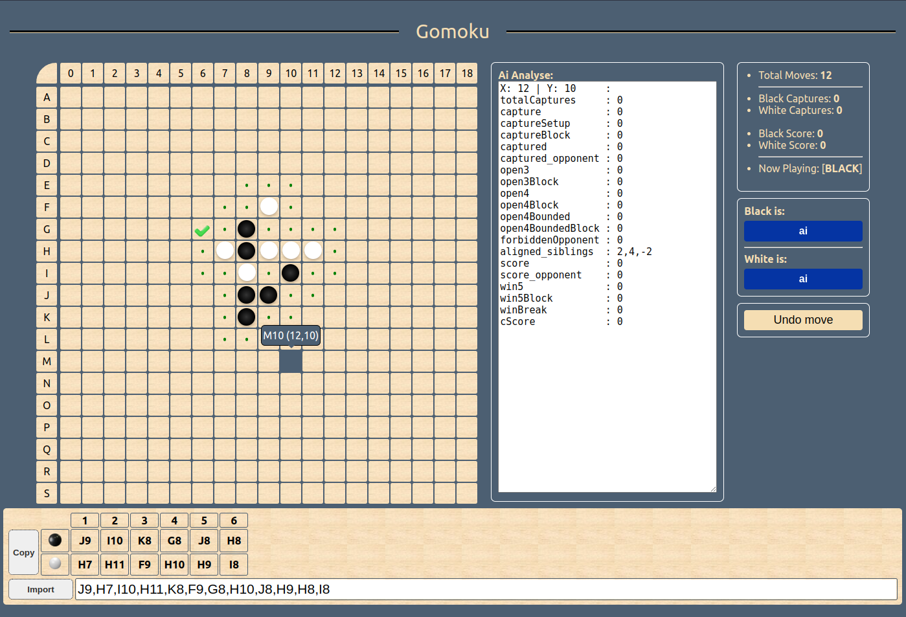
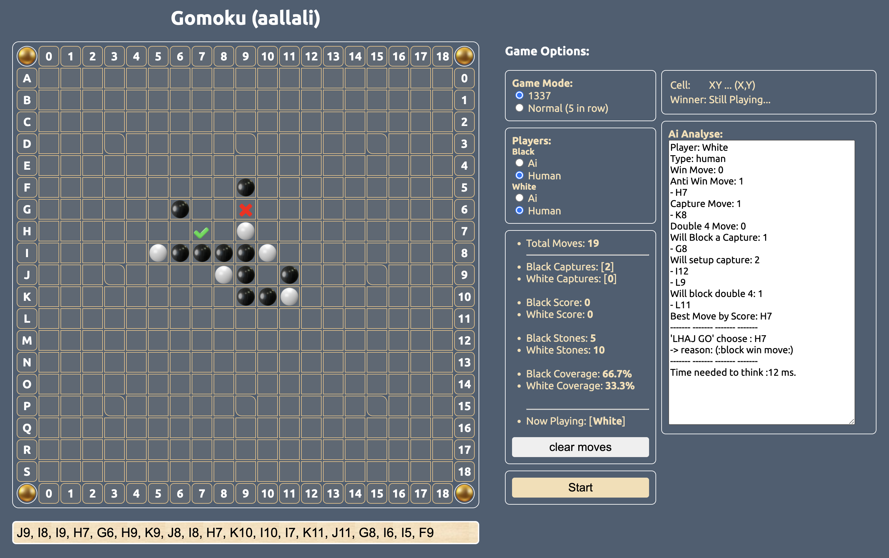

# 42-Gomuku
This project involves creating, in the language of your choice, a Gomoku game integrating an AI player capable of beating a human player the fastest way possible. To do this, you will implement a min-max algorithm but also do research, trial and error to find the most adapted heuristics. This will not be as easy as checkers. 

---

### update 17/12/2023 :
- Migrated the app to TypeScript/Vue 3.
- Still under construction 🚧 (80% of the work done).
- Optimization is progressing well so far, but there's room for more improvement.
- Wrote a move sorting algorithm based on properties calculated from the `MoveReport` class, such as `capture, block capture, open 4, block 3, alignment with other peers,... etc`. (still needs improvement).

- live here : https://gomoku.allali.me/
- Ai Analayse text area currentl contains only basic details. (will be updated)
- **TODO**:
    - [ ] Include a scenario where:
        - There are three pieces in a row.
        - The fourth position is a forbidden cell for the opponent.
        - Place the fourth piece/move in the fifth position, which may be allowed for the opponent.
        - By doing so, we are one move away from achieving a five-in-a-row win, and the opponent cannot prevent it.
    - [ ] Implement limited-depth Minimax to check for any potential unhandled cases.
        - [x] experiment it a little bit
    - [x] implement moves import
    - [x] implement Undo move
    - [x] detect if the capture move will also break an open4/open3
    - [x] `[fix]` : all the moves considered "will be captured" are ignored even if a fifth (winning) capture move is there, adapt script to bypass this one
    - [x] `[fix]` : set open3/open4 only if all the pieces forming it are not in to-be-capture position
        - scenario: 
            - `B1,B2,B4,C1,A3,D0,C2,D3,A0,D2,D4`
        - [x] fix it for open3
        - [x] fix it for open4 
        - [x] fix it for block_open3
        - [x] fix it for block_open4
        - [ ] if you can improve that logic (that do the check above), will be great (`priority:low`)
    - [ ] `[fix]` : correct move for black is `K10` but it chosed to block fifth move in open 4, which is lost any way, instead setup a capture that will break this win5 row and also make the fifth capture which is winnable
        - scenario : 
            - `J9,I8,I9,H9,J7,K9,G10,J8,I7,K7,L10,H7,H10,F10,I10,I7,J7,G7,H9,I8,J9,F11,G6,K8,K9,H11,K6,I8,L5,M11,J8,J9,J6,I6,L6,I5`
        - solution : 
            - always prioritize to break a win5 by capture/or setup capture.
                - can be open4
                - can be open4 split to 2 (`XX_XX`)
                - check for block win5 move first, then start check for any capture that will block that
    - [ ] `[fix]` : a perfect capture setup is when the capture spot is valid move for me
        - update capture setup field with 2 fields :
            - `captureSetupPerfect`
            - `captureSetupImperfect`
    - [x] `[check]` : still have captures to break the row of 5 but considered white as winner
        - scenario : 
            - `I9,H8,H10,J8,G11,I8,G8,H7,H6,H9,G7,G6,J7,F5,E4,J9,J10,J9,G10,I8`
            - `I9,H8,H10,J8,G11,I8,G8,H7,H6,H9,G7,G6,J7,F5,E4,J9,G10,I8,H9,H7`
            - `I9,H8,H10,J8,G11,I8,G8,H7,H6,H9,G7,G6,J7,F5,E4,J9,J10,J9,G10,F4,F3,I8`
        - checked but nothing look wrong !!
    - [ ] `[improve]` : best move is `F5` but chosed `F3`, not a bug actually, but if `F5` played, it will force the black to play F3 because it gonna block the win5, which is an "in-capture" move for him, so we gain a free capture
        - scenario :
            - `B1,B2,B4,C1,A3,D0,C2,D3,A0,D2,D4,G5,B8,H6,B9,F4,E3,J8,I7,F2,B0,C5,A2,D2,E3,A4,D1,A1,E1,F1,F0,B10,B7,B5,D5`
        - how to solutions: 
            - try to detect if a move will force bad move for opponent
            - try to reverse the process by finding the bad move for him, and check if it can be forced by making him play it to block an open4 or win5
    - [ ] `[fix]` : black aligned  6 in row, the opponent still had to capture the last rock, but even tho, it doesnt break the win 5, so it should declare black as winner directly
        - scenario:
            - `B1,B2,B4,C1,A3,D0,C2,D3,A0,D2,D4,G5,B8,H6,B9,B10,D1,E4,F4,E0,C0,F0,H0,I7,K9,A2,B7,B5,D3,D5,F3,G4,C6,E4,D5,D2,G3,E3,E2,D7,E5,E4,D6,H2,C7,A7,C7,B7`
        - solution:
            - when verify if the opoonent's captures are covering the row, we also have to check i the remaining pieces are forming a 5win row.
    - [x] `[fix]` : the white chosed to block 5 in row win, but that position is a capture for white if black played it, and white was one capture away to win, so just ignore him and play my open4.
        - scenario:
            - `J9,I8,I9,H9,J7,K9,G10,J8,I7,K7,L10,H7,H10,F10,I10,I7,J7,G7,H9,I8,J9,F11,G6,K8,K9,H11,K6,I8,L5,M11,J8,J9,J6,I6,L6,I5,I4,I10,I9`
        - solution:
            - try to find an adapted condition inside the sorter, **otherwise just add custom condition for this case outside the scope**
            - i excluded this specific move for black, and let the sorter work normally
            ```ts
            const badWin5EnemyFilter = (l: TMvRepport) => l.win5Block && l.captured_opponent
            if (
                player1Captures === 4 
                && player2Captures < 5 
                && moves.find(badWin5EnemyFilter)
            ){
                moves = moves.filter(l => !badWin5EnemyFilter(l))
            }
            ```



---
### 30/06/2023 (second day of AÏD AL ADHAA):

I started this project 1 year ago (March 2022, I think) as a school project. I began with a simple React app and attempted to implement the solver within it. I encountered performance issues, of course (you can't apply hardcore MiniMax in the browser, haha 😆). 
Well, I worked on it for a month or two, then put it on hold since no solution was clear at that time.


Recently, I revisited the project, this time developing the solver engine in the Go language for its speed, which proved to be quite fast. I implemented numerous algorithms and strategies, gaining valuable insights along the way. Unfortunately, the outcomes did not meet expectations. The algorithm was required to identify the optimal move in less than half a second, and my code lacked organization, coupled with subpar and inefficient heuristics. Faced with these challenges, I decided to abandon the project. 
 
But, i gained significant insights into a technique known as NES (Natural Evolution Strategy). This method involves analyzing the board for potential threats or offensive moves. It works flawlessly for the standard "5 in a row" rule. However, in our scenario with custom rules (such as captures, restrictions on capturing moves, and the prohibition of moves forming a double free three shape), I had to devise a solution. After numerous retries and tests, I managed to develop the initial version. It took thousands of attempts to arrive at the optimal combination for this algorithm. I continue to refine it by playing more games against the AI.

The JavaScript algorithm operates in the browser with an accompanying UI shown in the image. Implemented using only HTML, CSS, and JavaScript—no frameworks—it utilizes a customized NES algorithm to efficiently choose optimal moves. Although the current functionality is strong, there's potential for further enhancements.

**13:34PM 32% Battery , i can hear the ADHAN (call for the prayer), by**

---
*`img updated: 29/07/2023`*


Todo:
- [x] : add support to switch modes (`1337 rules` && `normal`)
- [x] : support startup game from list of moves set in the '`Moves`' textarea
- [x] : add welcome animation at first load of page
- [x] : find and apply captures before running some checks inside the `AnalyseMoves(..)` function
- [x] : hover the 5 win pieces with bright color when the game ends
- [ ] : prevent the game from ending when there still a move that can break tht 5 in row
- [x] : make the '`Ai Suggestion`' part functional by including the moves analyse in there
    - [ ] : make the analyse more detailed
- [x] : organize the order of game start function to avoid conflicts.
    - [ ] : refactor it
- [ ] : improve algo to: if the oponent setup a capture, and you dont have any other good option to do except 'best by score', try to find if there is a possible move that will make the capture spot for him forbidden using 'forbidden in capture move' pattern.
- [x] : blink the captured pieces before removing them from board for more visibility
- [ ] : add board score calculation function and implement it to UI
- [ ] : fix the cases mentioned in history file 
