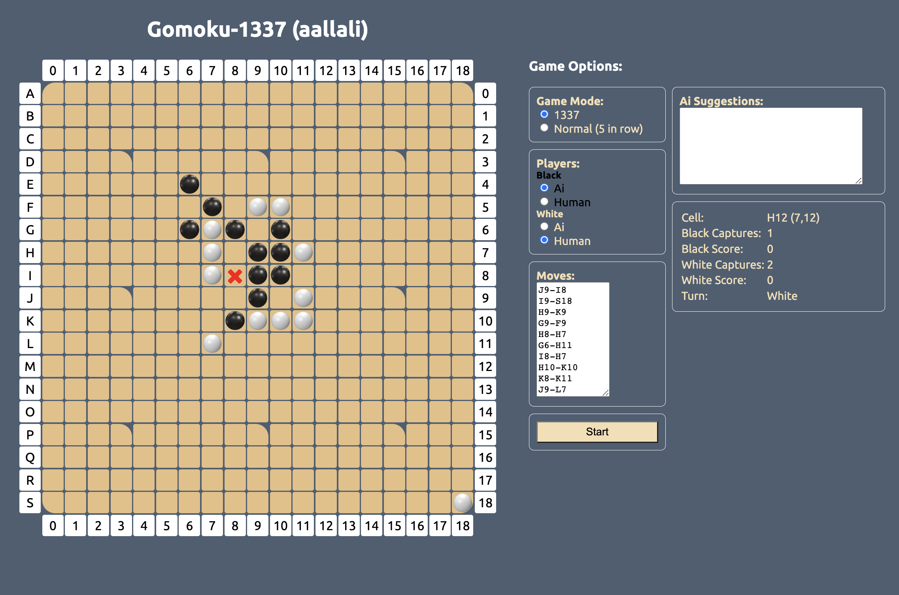

# 42-Gomuku
This project involves creating, in the language of your choice, a Gomoku game integrating an AI player capable of beating a human player the fastest way possible. To do this, you will implement a min-max algorithm but also do research, trial and error to find the most adapted heuristics. This will not be as easy as checkers. 

**30/06/2023 (second day of AÏD AL ADHAA):**
I started this project 1 years ago (Mars, 2022 i think) as a school project, started it as a simple react app and tried to implement the solver inside, been running through performance issues ofc (you can't apply hardcore MiniMax in the browser hhhh :') ), Well i worked on it for a month or 2 i remmeber then put it on hold, since no solution was clear for me then, 

Lately i came back to the project again, but this time writing the solver engine with GO language, for its speed, and it was honestly, applied many algorithms and strategies, learned a lot honestly, but the results wasn't as expected, since the Algorithm have to find the best move in under half of a second, and my code wasn't well organized, so i gave up on it, but

I learned a lot about a method called NES (Natural Evolution Strategy) where you study the board for any threats or offensive moves, it WORKS PERFECT for the mode (5 in a row rule), but in our case we have custom rules (captures, forbidden in capture move, forbidden move performing double free three shape), so i had to invent a solution for that, and managed to write the first version of this solution that took me 1000s of retries and tests before comming to ideal combination of this algorithm.

The algorithm fully writen in JS in the browser with the UI you can see in the picture (html/css/js only, no frameworks), it applies a modified NES algorithm, it chooses good moves actually, and still can be improved more.

**13:34PM 32% Battery , i can hear the ADHAN (call for the prayer), by**

