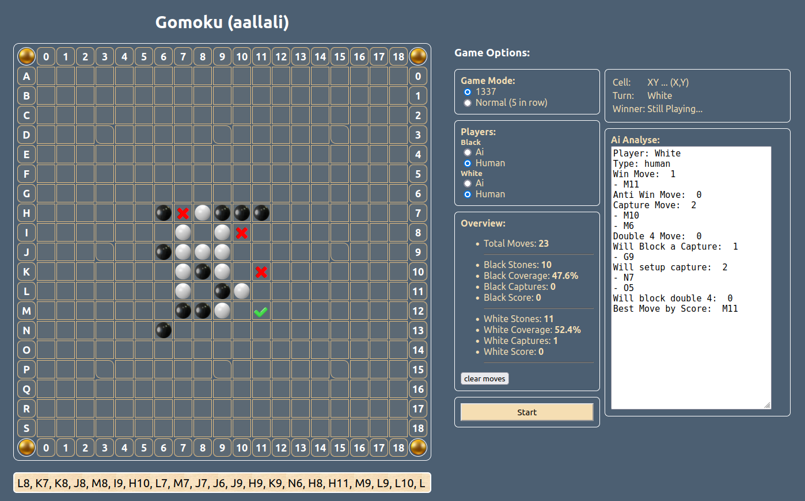

# 42-Gomuku
This project involves creating, in the language of your choice, a Gomoku game integrating an AI player capable of beating a human player the fastest way possible. To do this, you will implement a min-max algorithm but also do research, trial and error to find the most adapted heuristics. This will not be as easy as checkers. 

---
**30/06/2023 (second day of AÏD AL ADHAA):**

I started this project 1 years ago (Mars, 2022 i think) as a school project, started it as a simple react app, tried to implement the solver inside, been running through performance issues ofc (you can't apply hardcore MiniMax in the browser hhhh 😆 ), Well, I worked on it for a month or 2, then put it on hold, since no solution was clear then, 

Lately, I came back to the project again, this time writing the solver engine with GO language, for its speed, (and it was), applied many algorithms and strategies, learned a lot actually, but the results wasn't as expected, since the Algorithm have to find the best move in under half of a second, and my code wasn't well organized, so i gave up on it, but

I learned a lot about a method called NES (Natural Evolution Strategy) where you study the board for any threats or offensive moves, it WORKS PERFECT for the mode (5 in a row rule), but in our case we have custom rules (captures, forbidden in capture move, forbidden move performing double free three shape), 
I had to invent a solution for that, managed to write the first version of it that took me 1000s of retries and tests before comming to ideal combination of this algorithm (still improve it by playing more games against the AI)

The algorithm fully writen in JS in the browser with the UI you can see in the picture (html/css/js only, no frameworks), it applies a modified NES algorithm, it chooses good moves actually, and still can be improved more.

**13:34PM 32% Battery , i can hear the ADHAN (call for the prayer), by**

---
*`img updated: 09/07/2023`*

Todo:
- [x] : add support to switch modes (`1337 rules` && `normal`)
- [x] : support startup game from list of moves set in the '`Moves`' textarea
- [x] : add welcome animation at first load of page
- [x] : find and apply captures before running some checks inside the `AnalyseMoves(..)` function
- [x] : hover the 5 win pieces with bright color when the game ends
- [ ] : prevent the game from ending when there still a move that can break tht 5 in row
- [x] : make the '`Ai Suggestion`' part functional by including the moves analyse in there
    - [ ] : make the analyse more detailed
- [x] : organize the order of game start function to avoid conflicts.
    - [ ] : refactor it
- [ ] : improve algo to: if the oponent setup a capture, and you dont have any other good option to do except 'best by score', try to find if there is a possible move that will make the capture spot for him forbidden using 'forbidden in capture move' pattern.